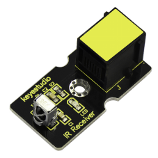
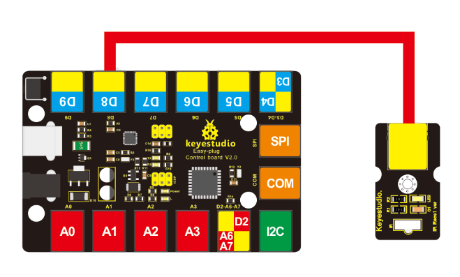
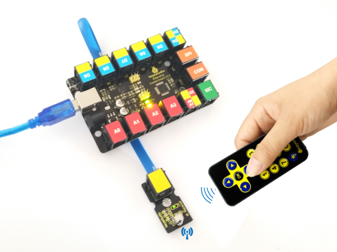
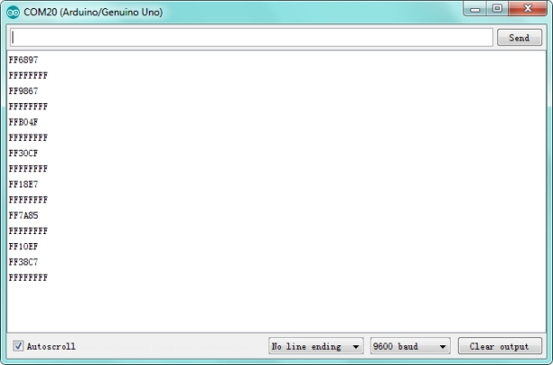

# KS0125 keyestudio EASY plug IR Receiver Module



## 1. Introduction

Infrared receiver is a component with functions of reception, amplification, and demodulation. The internal IC has already been demodulated so that can directly output digital signal.

Well, it will be also easy to make your own IR controller using IR transmitter. This module should be used together with EASY plug control board.

**Special Note:**

The sensor/module is equipped with the RJ11 6P6C interface, compatible with our keyestudio EASY plug Control Board with RJ11 6P6C interface.

If you have the control board of other brands, it is also equipped with the RJ11 6P6C interface but has different internal line sequence, can’t be used compatibly with our sensor/module.

## 2. Specification

- Connector: Easy plug
- Power Supply: 5V
- Interface:Digital
- Modulate Frequency: 38Khz

## 3. Technical Details

- Dimensions: 38mm * 20mm * 18mm
- Weight: 5g

## 4. Connect It Up

Connect the EASY Plug Infrared receiver sensor to control board using an RJ11 cable. Then connect the control board to your PC with a USB cable.



## 5. Upload the Code

Download code : [Resource](./Resource.7z)

Note： before uploading the code, you need to import the library files; otherwise, the code upload will fail.

```c
#include <IRremote.h>
int RECV_PIN = 8;
IRrecv irrecv(RECV_PIN);
decode_results results;

void setup()
{
    Serial.begin(9600);
    irrecv.enableIRIn(); // Start the receiver
}

void loop() 
{
    if (irrecv.decode(&results)) 
    {
        Serial.println(results.value, HEX);
        irrecv.resume(); // Receive the next value
    }
}
```

## 6. Result

Done uploading the code, when aiming at the IR receiver, press down the key on an IR remote controller, you should see the key decoding is displayed on the serial monitor in the Arduino IDE. 



